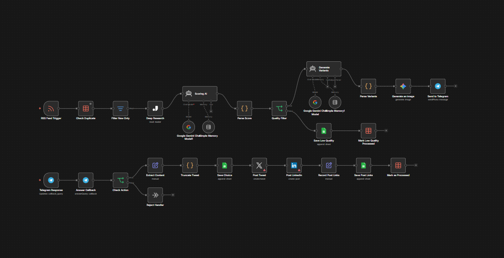

# 📰 DeepPublish AI: Autonomous Content Operations Engine

   

This is the technical documentation hub for the **DeepPublish AI** ecosystem. An industrial-grade n8n workflow designed to transform raw news feeds into high-authority social media presence.

---

### 🛠 Architecture Preview

> **The Content Revolution**
> Stop wasting hours on manual curation. DeepPublish AI acts as an autonomous newsroom that researches, filters, and prepares your social media posts while you sleep.

---

### 🧠 System Intelligence

* **Deep Research:** Integrated with **Jina AI** to scrape and analyze full article contexts, ensuring your content is deep, not just headline-level.
* **Smart Scoring:** Dual-layer filtering via **Gemini Pro & GPT-4** to select only 10/10 relevance leads based on your specific niche.
* **Multi-Platform Sync:** Unified approval system to publish perfectly formatted posts across **𝕏 (Twitter), LinkedIn, and Telegram** simultaneously.
* **Anti-Spam Logic:** Built-in duplicate detection and "Smart Delay" to keep your accounts safe and human-like.

---

### 🛠 Technical Architecture
The system is built on modular n8n logic, ensuring high stability, error handling, and easy scaling.
* **Trigger:** RSS Feeds / Webhooks / Scheduled Scrapers
* **Processing:** Advanced JSON parsing & LLM-based summarization
* **Storage:** Seamless integration with Google Sheets or Supabase for content logs

---

### 🚀 Implementation
This workflow is provided as a professional-grade JSON template. It includes:
* ✅ **Pre-configured nodes** for instant deployment.
* ✅ **Detailed setup guide** for API integrations.
* ✅ **Prompt templates** optimized for high-engagement social posts.

---

### 🛒 Get Full Access
Transform your content operations into a fully autonomous engine.

[**👉 Get DeepPublish AI on Gumroad**](https://naroka.gumroad.com/l/deeppublish-ai)
---
*Developed by [Naroka Studio](https://github.com/Naroka-Studio)*
